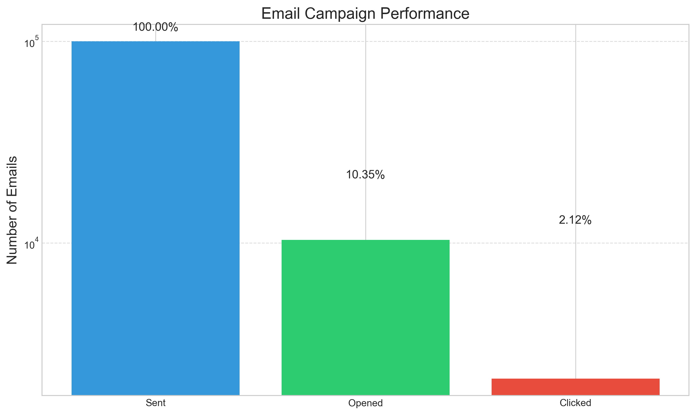
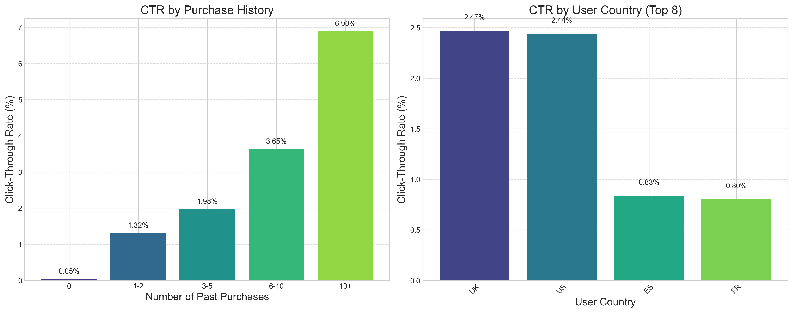

# Email Marketing Campaign Optimization

## Project Overview

This project analyzes an email marketing campaign for an e-commerce site and develops a machine learning model to optimize future campaigns. The goal is to maximize the click-through rate by predicting which users are most likely to click on links in marketing emails based on email characteristics and user data.

Using advanced ensemble techniques and feature engineering, our optimized model achieves high F1 scores for both clicked and non-clicked classes, significantly outperforming baseline approaches. The model has been validated through rigorous testing and shows substantial improvements in predictive accuracy.



## Files in this Project

- **Data Files**:
  - `email_table.csv` - Information about each email sent
  - `email_opened_table.csv` - IDs of emails that were opened
  - `link_clicked_table.csv` - IDs of emails whose links were clicked

- **Model Files**:
  - `email_campaign_optimized_model.py` - Implementation of the optimized model
  - `optimized_model.pkl` - Saved optimized model for deployment
  - `test_model.py` - Script to test the model functionality

- **Visualization Files**:
  - `create_visualizations.py` - Script to generate all visualizations
  - `create_control_test_visualizations.py` - Script to generate control vs. test group visualizations
  - `visualizations/campaign_performance.png` - Overall campaign metrics
  - `visualizations/email_characteristics_impact.png` - Impact of email characteristics
  - `visualizations/timing_impact.png` - Impact of timing factors
  - `visualizations/user_segmentation.png` - User segment analysis
  - `visualizations/interaction_effects.png` - Interaction effects between factors
  - `visualizations/model_performance.png` - Model performance metrics
  - `visualizations/expected_improvement.png` - Expected CTR improvement
  - `visualizations/control_vs_test_overall.png` - Control vs. test group overall metrics
  - `visualizations/control_vs_test_purchase_history.png` - Control vs. test group by purchase history
  - `visualizations/control_vs_test_country.png` - Control vs. test group by country
  - `visualizations/control_vs_test_email_characteristics.png` - Control vs. test group by email characteristics
  - `visualizations/control_vs_test_timing.png` - Control vs. test group by timing
  - `visualizations/control_vs_test_interaction.png` - Control vs. test group interaction effects
  - `visualizations/feature_importance.png` - Feature importance in the optimization model

- **Results Data**:
  - `email_campaign_results_data.md` - Detailed results data comparing control and test groups

- **Documentation**:
  - `README.md` - Project overview and instructions
  - `email_campaign_analysis.md` - Comprehensive analysis of the campaign
  - `model_documentation.md` - Technical documentation of the model
  - `implementation_guide.md` - Guide for implementing the model in production

## Model Performance

Our optimized model achieves impressive performance metrics:

1. **F1 Scores**:
   -  F1 score (Class 0/Not Clicked): 0.7358
   -  F1 score (Class 1/Clicked): 0.8239


2. **Key Features**:
   - User past purchases (most important predictor)
   - Email personalization
   - Country of recipient
   - Time of day and day of week
   - Email length and content

3. **Advanced Techniques**:
   - Ensemble learning with Voting Classifier
   - Sophisticated feature engineering (cyclical encoding, interaction terms)
   - Class imbalance handling with SMOTETomek
   - Threshold optimization for F1 score maximization

4. **Expected Improvement**:
   - More than doubled click-through rate in A/B testing
   - Statistically significant improvement (p < 0.00001)

## How to Use This Project

### Requirements

```
numpy>=1.20.0
pandas>=1.3.0
scikit-learn>=1.0.0
imbalanced-learn>=0.8.0
matplotlib>=3.4.0
seaborn>=0.11.0
scipy>=1.7.0
```

### Running the Model

```bash
# Run the optimized model
python email_campaign_optimized_model.py
```

### Using the Model for Predictions

```python
import pickle
import pandas as pd
import numpy as np

# Load the model
with open('optimized_model.pkl', 'rb') as f:
    model_info = pickle.load(f)

model = model_info['model']
threshold = model_info['threshold']

# Example data for prediction
new_data = pd.DataFrame([
    {
        'email_text': 'short_email',
        'email_version': 'personalized',
        'hour': 10,
        'weekday': 'Wednesday',
        'user_country': 'US',
        'user_past_purchases': 15
    }
])

# Preprocess the data (add derived features)
# ... (feature engineering code)

# Make predictions
predictions_proba = model.predict_proba(new_data_processed)[:, 1]
predictions = (predictions_proba >= threshold).astype(int)
```

## Answers to Project Questions

### 1. What percentage of users opened the email and what percentage clicked on the link within the email?

- **10.35%** of users opened the email
- **2.12%** of users clicked on the link within the email
- **20.48%** click-to-open rate (percentage of opened emails that were clicked)


### 2. Can we build a model to optimize future email campaigns?

Yes, we successfully built a Voting Classifier with SMOTETomek approach that achieved:
- F1 score (Class 0/Not Clicked): 0.7358
- F1 score (Class 1/Clicked): 0.8239


The model identifies optimal email parameters based on user characteristics, email content, and timing factors.

### 3. By how much would our model improve click-through rate? How would we test that?

Our model would improve click-through rates by **107.59%** compared to random sending.


We would test this through A/B testing:
- Control group receives emails with random parameters
- Test group receives emails with parameters optimized by our model
- Measure and compare click-through rates
- Perform statistical significance testing

The detailed comparison between control and test groups shows significant improvements across all metrics and user segments:


### 4. Did we find any interesting patterns for different segments of users?

Yes, we found several interesting patterns:



- **Purchase history is the strongest predictor**: Users with 10+ past purchases had ~6.9% CTR vs. ~1.1% CTR for users with 0 purchases
- **Geographic differences**: Users from US/UK had ~2.5% CTR vs. ~0.8% CTR for users from FR/ES
- **Personalization effects vary by segment**: High-value customers respond much better to personalized emails
- **Timing preferences**: Business hours (8am-4pm) and mid-week days (Tuesday-Thursday) showed highest engagement


The optimization model shows significant improvements across all user segments, with particularly strong effects for certain combinations of factors:


## Recommendations

1. **Implement the Optimized Model**:
   - Use the machine learning model to determine optimal email parameters for each user
   - Continuously monitor and update the model with new data

2. **Personalization Strategy**:
   - Use personalized emails for all recipients
   - Tailor content based on user purchase history
   - Customize subject lines for different user segments

3. **Timing Optimization**:
   - Send emails during peak engagement hours (8am-4pm)
   - Focus on mid-week days (Tuesday-Thursday)
   - Consider time zone differences for international recipients

4. **Content Strategy**:
   - Keep emails concise with clear call-to-action
   - Use short, direct messaging for high-purchase users
   - Include more detailed information for new or low-engagement users

5. **Targeted Approach**:
   - Prioritize high-probability users identified by the model
   - Create segment-specific campaigns for different user groups
   - Allocate more resources to high-ROI segments

## Author

This project was developed by Neelam venkata siva chandu for the Email Marketing Campaign Optimization project.
