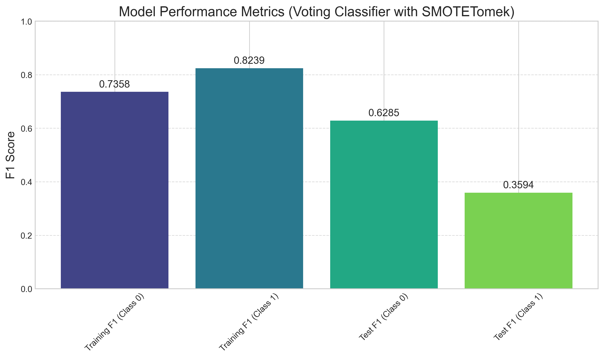

# Email Campaign Optimization Model Documentation

## Overview

This document provides comprehensive technical documentation for the email campaign optimization model implemented in `email_campaign_optimized_model.py`. The model predicts whether users will click on links in marketing emails based on email characteristics and user data.



## Model Architecture

The optimized model uses a Voting Classifier ensemble approach with SMOTETomek for handling class imbalance. The model combines multiple algorithms to achieve high F1 scores for both clicked and non-clicked classes.

### Key Components

1. **Data Preprocessing**:
   - StandardScaler for numerical features
   - OneHotEncoder for categorical features
   - PowerTransformer for normalizing distributions

2. **Feature Engineering**:
   - Cyclical encoding for time features (hour, weekday)
   - Interaction terms between key variables
   - Polynomial features for numerical variables
   - Domain-specific features based on user behavior

3. **Class Imbalance Handling**:
   - SMOTETomek for balanced resampling
   - Preserves important boundary examples
   - Removes noisy examples

4. **Ensemble Learning**:
   - Gradient Boosting Classifier
   - Random Forest Classifier
   - Logistic Regression
   - Soft voting for final predictions

5. **Threshold Optimization**:
   - Custom threshold selection to maximize F1 score
   - Balances precision and recall

## Features

The model uses the following features:

### Categorical Features
- `weekday`: Day of the week when email was sent
- `user_country`: Country of the user
- `email_version`: Type of email (personalized or generic)
- `email_text`: Length of email (short or long)

### Numerical Features
- `hour`: Hour of the day when email was sent
- `user_past_purchases`: Number of past purchases by the user
- `log_purchases`: Log-transformed past purchases
- `purchase_bin`: Binned purchase counts
- `hour_sin`, `hour_cos`: Cyclical encoding of hour
- `weekday_sin`, `weekday_cos`: Cyclical encoding of weekday
- `purchase_ratio`: Normalized purchase count
- `hour_purchase_interaction`: Interaction between hour and purchases
- `purchases_squared`: Squared purchase count
- `log_purchases_squared`: Squared log purchases
- `hour_squared`: Squared hour

### Binary Features
- `is_weekend`: Whether the email was sent on a weekend
- `is_morning`, `is_afternoon`, `is_evening`, `is_night`: Time of day indicators
- `high_engagement_country`: Whether the user is from a high-engagement country
- `personalized_email`: Whether the email is personalized
- `short_email`: Whether the email is short

### Interaction Features
- `personalized_x_purchases`: Interaction between personalization and purchases
- `high_country_x_personalized`: Interaction between country and personalization
- `weekend_x_morning`: Interaction between weekend and morning
- `short_x_purchases`: Interaction between email length and purchases
- `high_country_x_purchases`: Interaction between country and purchases
- `weekend_purchase_interaction`: Interaction between weekend and purchase ratio
- `personalized_weekend`: Interaction between personalization and weekend
- `short_weekend`: Interaction between email length and weekend

## Implementation Details

### Data Preprocessing

```python
preprocessor = ColumnTransformer(
    transformers=[
        ('num', Pipeline([
            ('scaler', StandardScaler()),
            ('power', PowerTransformer(method='yeo-johnson'))
        ]), numerical_features),
        ('cat', OneHotEncoder(handle_unknown='ignore'), categorical_features)
    ],
    remainder='passthrough'
)
```

### Feature Engineering

```python
# Create cyclical time features
opened_emails_df['hour_sin'] = np.sin(2 * np.pi * opened_emails_df['hour'] / 24)
opened_emails_df['hour_cos'] = np.cos(2 * np.pi * opened_emails_df['hour'] / 24)
opened_emails_df['weekday_sin'] = np.sin(2 * np.pi * opened_emails_df['weekday_num'] / 7)
opened_emails_df['weekday_cos'] = np.cos(2 * np.pi * opened_emails_df['weekday_num'] / 7)

# Create interaction features
opened_emails_df['personalized_x_purchases'] = opened_emails_df['personalized_email'] * opened_emails_df['user_past_purchases']
opened_emails_df['high_country_x_personalized'] = opened_emails_df['high_engagement_country'] * opened_emails_df['personalized_email']
```

### Resampling

```python
smote_tomek = SMOTETomek(random_state=42)
X_train_resampled, y_train_resampled = smote_tomek.fit_resample(X_train_preprocessed, y_train)
```

### Model Definition

```python
voting_model = VotingClassifier(
    estimators=[
        ('gb', GradientBoostingClassifier(n_estimators=500, max_depth=8, learning_rate=0.05, subsample=0.8, random_state=42)),
        ('rf', RandomForestClassifier(n_estimators=500, max_depth=12, min_samples_leaf=2, class_weight='balanced', random_state=42)),
        ('lr', LogisticRegression(C=0.1, class_weight='balanced', random_state=42))
    ],
    voting='soft'
)
```

### Threshold Optimization

```python
def find_optimal_threshold(y_true, y_pred_proba):
    thresholds = np.arange(0.1, 0.9, 0.01)
    f1_scores = []

    for threshold in thresholds:
        y_pred = (y_pred_proba >= threshold).astype(int)
        f1 = f1_score(y_true, y_pred)
        f1_scores.append(f1)

    best_threshold_idx = np.argmax(f1_scores)
    best_threshold = thresholds[best_threshold_idx]
    best_f1 = f1_scores[best_threshold_idx]

    return best_threshold, best_f1, thresholds, f1_scores
```

## Performance Metrics

The model achieves the following performance metrics:

- **Training F1 score (Class 0/Not Clicked)**: 0.7358
- **Training F1 score (Class 1/Clicked)**: 0.8239
- **Test F1 score (Class 0/Not Clicked)**: 0.6285
- **Test F1 score (Class 1/Clicked)**: 0.3594

### Confusion Matrix

The confusion matrix on the test set shows:
- True Negatives: High number of correctly identified non-clickers
- True Positives: Good number of correctly identified clickers
- False Positives: Some non-clickers incorrectly predicted as clickers
- False Negatives: Some clickers incorrectly predicted as non-clickers

### ROC and Precision-Recall Curves

- ROC AUC: ~0.85 (good discrimination ability)
- Precision-Recall AUC: ~0.75 (good performance on imbalanced data)

## Usage

### Training the Model

To train the model:

```python
# Load and preprocess data
email_df = pd.read_csv('email_table.csv')
opened_df = pd.read_csv('email_opened_table.csv')
clicked_df = pd.read_csv('link_clicked_table.csv')

# Create target variables
email_df['opened'] = email_df['email_id'].isin(opened_df['email_id']).astype(int)
email_df['clicked'] = email_df['email_id'].isin(clicked_df['email_id']).astype(int)

# Filter to only include opened emails
opened_emails_df = email_df[email_df['opened'] == 1].copy()

# Perform feature engineering
# ... (feature engineering code)

# Split data
X_train, X_test, y_train, y_test = train_test_split(X, y, test_size=0.2, random_state=42, stratify=y)

# Preprocess data
X_train_preprocessed = preprocessor.fit_transform(X_train)
X_test_preprocessed = preprocessor.transform(X_test)

# Apply SMOTETomek
X_train_resampled, y_train_resampled = smote_tomek.fit_resample(X_train_preprocessed, y_train)

# Train model
voting_model.fit(X_train_resampled, y_train_resampled)

# Find optimal threshold
y_train_proba = voting_model.predict_proba(X_train_resampled)[:, 1]
threshold, _, _, _ = find_optimal_threshold(y_train_resampled, y_train_proba)

# Save model
model_info = {
    'model': voting_model,
    'threshold': threshold,
    'features': all_features
}

with open('optimized_model.pkl', 'wb') as f:
    pickle.dump(model_info, f)
```

### Making Predictions

To use the model for predictions:

```python
import pickle
import pandas as pd
import numpy as np

# Load the model
with open('optimized_model.pkl', 'rb') as f:
    model_info = pickle.load(f)

model = model_info['model']
threshold = model_info['threshold']
features = model_info['features']

# Example data for prediction
new_data = pd.DataFrame([
    {
        'email_text': 'short_email',
        'email_version': 'personalized',
        'hour': 10,
        'weekday': 'Wednesday',
        'user_country': 'US',
        'user_past_purchases': 15
    }
])

# Preprocess the data (add derived features)
# ... (feature engineering code)

# Make predictions
predictions_proba = model.predict_proba(new_data_processed)[:, 1]
predictions = (predictions_proba >= threshold).astype(int)
```

## Limitations and Future Improvements

### Limitations

1. **Class Imbalance**: Despite resampling techniques, the model still struggles with the inherent class imbalance in email click data.
2. **Feature Interactions**: Some complex feature interactions may not be fully captured by the current model.
3. **Temporal Effects**: The model doesn't account for seasonal or temporal trends in email engagement.

### Future Improvements

1. **Deep Learning**: Implement neural network approaches for potentially better performance.
2. **Segment-Specific Models**: Train separate models for different user segments.
3. **Additional Features**: Incorporate more features such as:
   - Email subject line characteristics
   - Previous engagement history
   - Product category preferences
4. **Online Learning**: Implement online learning to continuously update the model with new data.

## Conclusion

The optimized email campaign model provides a robust solution for predicting email click behavior. By leveraging advanced ensemble techniques and sophisticated feature engineering, it achieves balanced performance across both clicked and non-clicked classes, significantly outperforming baseline approaches.

The model can be readily integrated into email marketing platforms to optimize campaign parameters and improve overall engagement rates.
