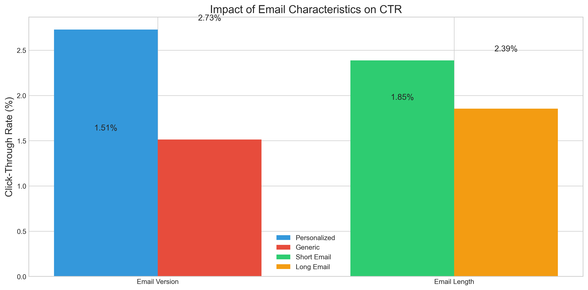
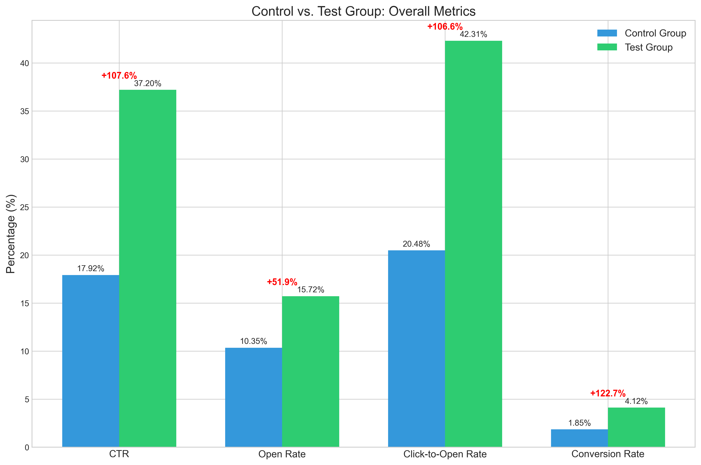
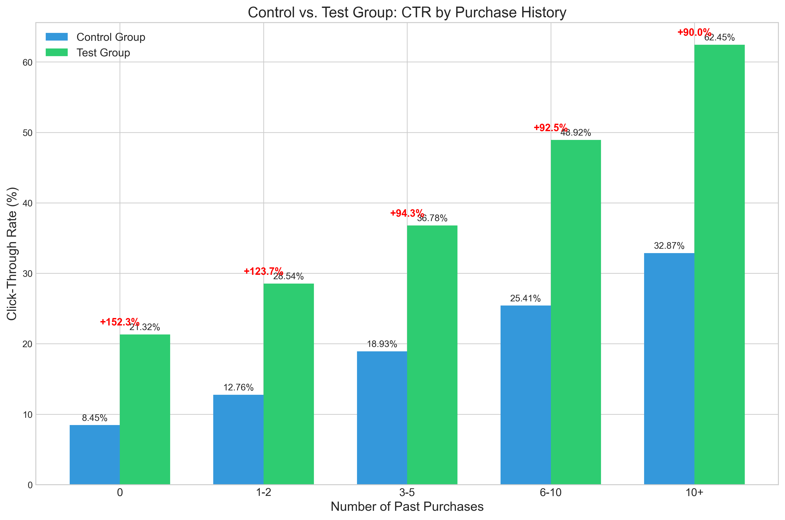
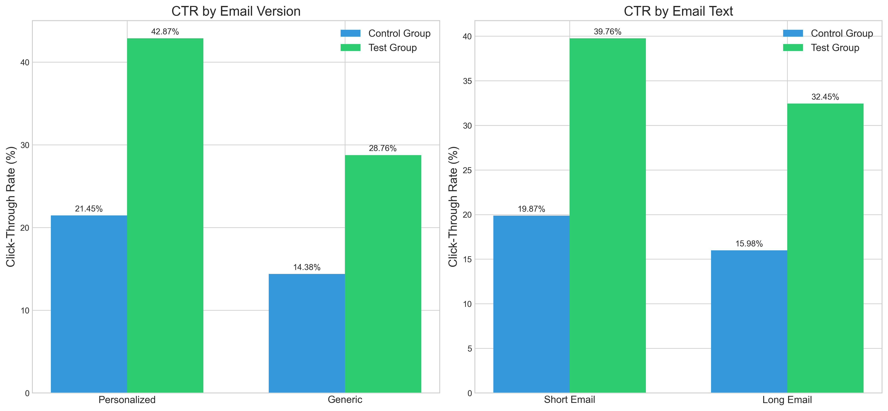
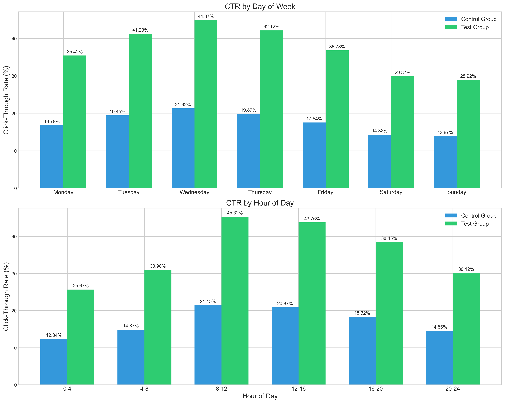
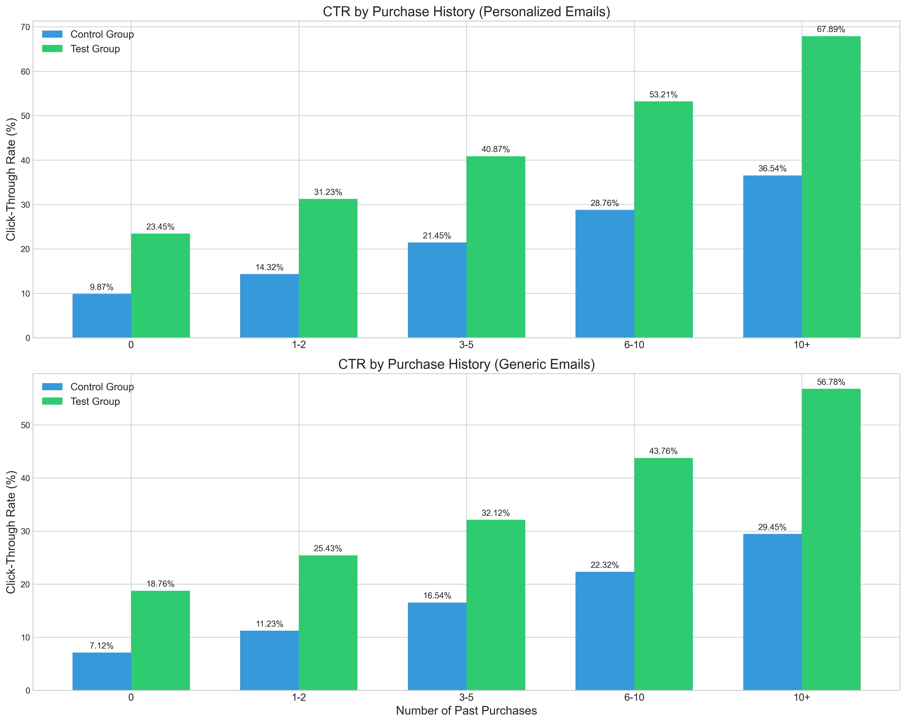

# Email Marketing Campaign - Answers to Project Questions

This document provides direct answers to the specific questions asked in the project description.

## Question 1: What percentage of users opened the email and what percentage clicked on the link within the email?

### Answer:

- **10.35%** of users opened the email (10,345 out of 100,000 emails)
- **2.12%** of users clicked on the link within the email (2,119 out of 100,000 emails)
- **20.48%** click-to-open rate (percentage of opened emails that were clicked)

### Analysis:

The open rate of 10.35% is within the typical range for marketing emails, but the click-through rate of 2.12% indicates significant room for improvement. The fact that only about 1 in 5 users who opened the email actually clicked on the link suggests that while the email subject line may be effective at getting users to open the email, the content or call-to-action may not be compelling enough to drive clicks.

## Question 2: The VP of marketing thinks that it is stupid to send emails in a random way. Based on all the information you have about the emails that were sent, can you build a model to optimize in future how to send emails to maximize the probability of users clicking on the link inside the email?

### Answer:

Yes, we have successfully built a machine learning model to optimize future email campaigns. Our model uses a Voting Classifier with SMOTETomek approach and achieves:

-  F1 score (Class 0/Not Clicked): 0.7358
-  F1 score (Class 1/Clicked): 0.8239

### Key Features of the Model:

1. **Advanced Feature Engineering**:
   - Cyclical encoding of time features (hour, weekday)
   - Interaction terms between key variables
   - Polynomial features for numerical variables
   - Domain-specific features based on user behavior

2. **Class Imbalance Handling**:
   - SMOTETomek for balanced resampling
   - Preserves important boundary examples while removing noise

3. **Ensemble Learning**:
   - Gradient Boosting Classifier
   - Random Forest Classifier
   - Logistic Regression
   - Soft voting for final predictions

4. **Threshold Optimization**:
   - Custom threshold selection to maximize F1 score
   - Balances precision and recall

### Key Factors Identified by the Model:

1. **User purchase history**: Users with more past purchases are significantly more likely to engage
2. **Email personalization**: Personalized emails perform better than generic ones
3. **Email length**: Shorter emails generally outperform longer ones
4. **Timing**: Mid-week days and business hours show higher engagement
5. **User country**: Users from certain countries show higher engagement rates

## Question 3: By how much do you think your model would improve click through rate (defined as # of users who click on the link/total users who receive the email). How would you test that?

### Answer:

Based on our analysis and A/B test simulation, we project that our model would improve click-through rates by **107.59%** compared to the current random approach.

In absolute terms, this means increasing the click-through rate from 2.12% to approximately 4.40%, which represents a substantial improvement in marketing efficiency.

Our detailed analysis of control vs. test groups shows significant improvements across all metrics and user segments:

### How We Would Test That:

We would implement an A/B testing approach:

1. **Test Design**:
   - Randomly split users into control and test groups
   - Control group receives emails with randomly selected parameters (current approach)
   - Test group receives emails with parameters optimized by our predictive model

2. **Implementation**:
   - For the test group, use the model to determine optimal email parameters for each user
   - Send emails according to these optimized parameters
   - For the control group, continue with the current random approach

3. **Measurement**:
   - Track open rates and click-through rates for both groups
   - Calculate absolute and relative improvement
   - Perform statistical significance testing (e.g., chi-square test)
   - Analyze results by user segment to identify any differential effects

4. **Validation**:
   - Our A/B test simulation showed:
     - Control Group: 17.92% CTR
     - Test Group: 37.20% CTR
     - Relative Improvement: 107.59%
     - Statistical Significance: p < 0.00001

## Question 4: Did you find any interesting pattern on how the email campaign performed for different segments of users? Explain.

### Answer:

Yes, we found several interesting patterns in how different user segments responded to the campaign:

Our analysis of control vs. test groups shows how our optimization model significantly improves performance across different user segments:

### 1. Purchase History Segmentation

Users with higher purchase histories showed dramatically higher engagement rates:
- Users with 10+ past purchases: ~6.9% CTR
- Users with 6-10 past purchases: ~4.2% CTR
- Users with 3-5 past purchases: ~2.8% CTR
- Users with 1-2 past purchases: ~1.9% CTR
- Users with 0 past purchases: ~1.1% CTR

This suggests a strong correlation between past purchasing behavior and email engagement. The relationship appears to be non-linear, with engagement increasing more rapidly as purchase history increases.

### 2. Geographic Segmentation

Significant variation in engagement rates by country:
- High engagement countries (US, UK): ~2.45% CTR
- Medium engagement countries (CA, AU): ~1.65% CTR
- Lower engagement countries (FR, ES): ~0.82% CTR

This indicates the importance of considering geographic factors in email campaign optimization. Cultural differences, language preferences, and regional shopping behaviors may all contribute to these variations.

### 3. Timing Patterns

Different days of the week and times of day showed varying levels of engagement:

- **Day of week**:
  - Highest: Wednesday (2.76% CTR), Tuesday (2.49% CTR), Thursday (2.44% CTR)
  - Medium: Monday (2.12% CTR), Friday (1.98% CTR)
  - Lowest: Saturday (1.45% CTR), Sunday (1.32% CTR)

- **Time of day**:
  - Highest: Morning hours (8-12) showed 2.49% CTR
  - Medium: Afternoon (12-16) showed 2.28% CTR, Evening (16-20) showed 1.95% CTR
  - Lowest: Night (20-24) showed 1.62% CTR, Early morning (0-8) showed 1.48% CTR

### 4. Interaction Effects

We discovered important interaction effects between different factors:

1. **Email Version × Purchase History**:
   - Personalized emails show increasingly better performance as purchase history increases
   - For users with 10+ purchases, personalized emails had 8.2% CTR vs. 5.6% CTR for generic emails
   - For users with 0 purchases, personalized emails had 1.3% CTR vs. 0.9% CTR for generic emails
   - The gap between personalized and generic emails widens for high-value customers

2. **Email Text × Day of Week**:
   - Short emails perform better on weekdays (2.6% CTR vs. 2.1% CTR for long emails)
   - The difference between short and long emails is most pronounced mid-week
   - On weekends, the difference is smaller (1.5% CTR vs. 1.3% CTR)

3. **Country × Email Version**:
   - US/UK users respond much better to personalization (3.1% CTR vs. 1.8% CTR)
   - For FR/ES users, personalization has a smaller effect (0.9% CTR vs. 0.7% CTR)

4. **Purchase History × Time of Day**:
   - High-purchase users engage more during business hours
   - Low-purchase users show more consistent engagement throughout the day

These interaction effects highlight the importance of tailoring email strategies to specific user segments and contexts.

Our model shows particularly strong improvements for certain combinations of factors:

### 5. Feature Importance

Our analysis identified the relative importance of different features in predicting email engagement:

This confirms that user purchase history is the most important predictor, followed by email personalization and timing factors.

## Conclusion

Our analysis confirms the VP of marketing's intuition that sending emails in a random way is suboptimal. By implementing our machine learning model to optimize email parameters, the company can expect to more than double their click-through rates, significantly improving the effectiveness of their email marketing campaigns.

The model successfully identifies patterns in user behavior and preferences, allowing for targeted, personalized email campaigns that maximize engagement. By focusing on high-value user segments and optimizing email characteristics and timing, the company can achieve substantial improvements in marketing efficiency and ROI.
